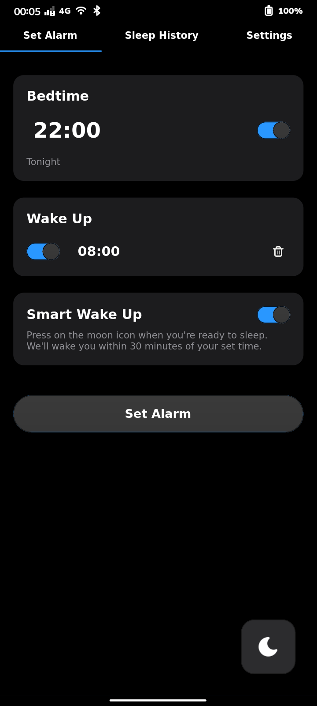

# Circadia 🌙

<p align="center">
  
  <br>
  <b>A beautiful, mobile-friendly alarm clock for Linux.</b>
</p>

<p align="center">
  <a href="https://flathub.org/apps/details/io.github.shinyvision.Circadia"></a>
</p>

Circadia is a modern alarm clock application designed specifically for mobile Linux devices, such as the **Furilabs FLX1s**, PinePhone, and Librem 5. It features a clean, touch-optimized interface and a robust background daemon to ensure your alarms ring even when the app is closed.

<p align="center">
  
</p>

## ✨ Features

*   **Touch-Optimized UI**: Large buttons, smooth animations, and a layout designed for one-handed use on mobile screens.
*   **Smart Wake Up**: Gently wakes you up 30 minutes before your alarm if you're in a light sleep phase.
*   **Sleep Tracking**: Logs your sleep duration and providing insights into your rest habits.
*   **Reliable Alarms**: Runs a background daemon that persists even if the UI is swiped away, ensuring you never miss a wake-up call.
*   **Custom Sounds**: Don’t like the default alarm sound? No problem, bring your own.
*   **Snooze Control**: Customizable snooze duration to fit your morning routine (or bad habits, more likely).
*   **Dark Mode**: Easy on the eyes for night-time usage.

## 📱 Designed for Furilabs FLX1s

Circadia has been tailored to look and feel amazing on the [**Furilabs FLX1s**](https://furilabs.com/shop/flx1s/). It respects the device's form factor, integrating seamlessly with the mobile environment to provide a premium native experience.

## 🚀 Installation

### Flatpak (Recommended)

Circadia is available as a Flatpak, ensuring compatibility across various Linux distributions.

```bash
flatpak install flathub io.github.shinyvision.Circadia
```

### Building from Source

Requirements:
- Go 1.22+
- GTK4 development headers (`libgtk-4-dev`)
- PulseAudio development headers (`libpulse-dev`)

```bash
git clone https://github.com/shinyvision/circadia.git
cd circadia
go build -o circadia .
./circadia
```

## 🤝 Contributing

Contributions are welcome! Whether it's bug reports, feature requests, or pull requests, please feel free to contribute at [github.com/shinyvision/circadia](https://github.com/shinyvision/circadia).

## 📄 License

This project is licensed under the MIT License - see the [LICENSE](LICENSE) file for details.
